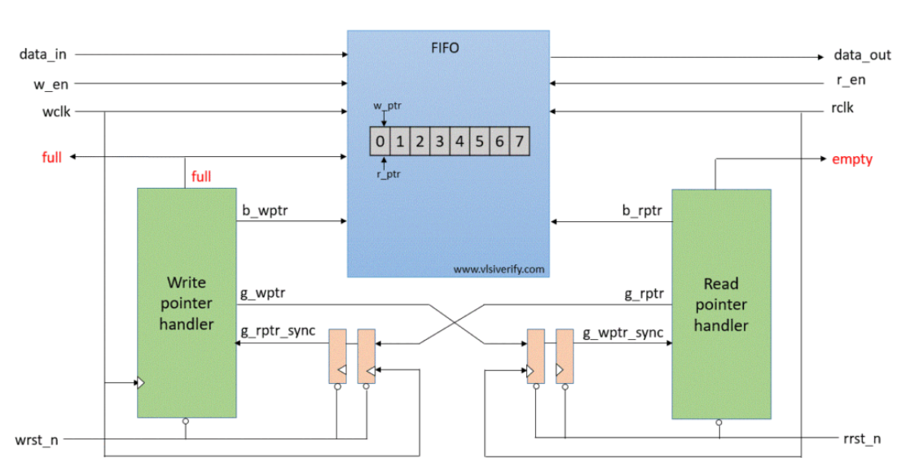
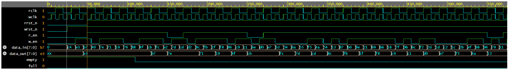

# Asynchronous FIFO UVM Testbench

**A UVM‑based verification environment for an asynchronous FIFO design in SystemVerilog.**

This repository contains:

* A **parameterized RTL implementation** of an asynchronous FIFO
* A complete **UVM testbench** to verify FIFO functionality across clock domains
* Reference models, agents, sequences, scoreboard, and testbench top
* Example simulation infrastructure that can be run in common simulators

---

## 📁 Repository Structure

```
Asynchronous_FIFO_UVM_TB/
├── design.sv                            # Asynchronous FIFO RTL and submodules
├── testbench.sv                         # UVM testbench (tb_pkg + tb_top)
├── images/Block_Diagram.png             # Design Block Diagram
├── waveforms/Async_FIFO_Waveform.png    # Waveform     
└── README.md                            # Project documentation
```

---

## 🧠 Project Overview

This project demonstrates a complete **Asynchronous FIFO verification** using the Universal Verification Methodology (UVM).

### 🧩 Why Asynchronous FIFO?

In many digital systems, data must be passed between two domains operating on **different clocks**. A FIFO (First‑In First‑Out) buffer with proper pointer synchronization ensures safe data transfer without metastability issues.

---

## 🔍 Design Details

### ➤ RTL Components

* **Interface (`intf`)** — Shared signals between DUT and testbench
* **Synchronizer** — Two‑stage flip‑flop synchronizer for pointer crossing
* **Write Pointer Handler (`wptr_handler`)** — Manages write pointer & full logic
* **Read Pointer Handler (`rptr_handler`)** — Manages read pointer & empty logic
* **FIFO Memory (`fifo_mem`)** — Storage array
* **Top Module (`asynchronous_fifo`)** — Floods all submodules together

## Block Diagram



Pointers are encoded in Gray code to safely transfer across clock domains.

✔ Full and Empty signals correctly generated

✔ Independent write and read clocks

✔ Parameterized DATA_WIDTH and DEPTH

---

## 🧪 Verification (UVM) Overview

The testbench verifies asynchronous FIFO across different clock domains.

### 🧩 UVM Components

* **Agents**

  * `wragent` — Write sequencer, driver, monitor
  * `rdagent` — Read sequencer, driver, monitor
* **Sequencers**

  * `wrseqr`, `rdseqr` — Transaction sequencers
* **Drivers**

  * `wrdriver`, `rddriver` — Drive DUT signals from sequences
* **Monitors**

  * `wrmon`, `rdmon` — Capture DUT behavior & send to scoreboard
* **Virtual Sequencer**

  * `my_virtual_seqr` — Controls both write and read sequences
* **Sequences**

  * `wrseq`, `rdseq` — Randomized transactions
  * `my_virtual_seq` — Starts write and read in parallel
* **Scoreboard**

  * Tracks expected FIFO data and compares with DUT output

All UVM components are contained inside `tb_pkg` and driven in `tb_top`.

## Virtual Sequence and Virtual Sequencer

To handle asynchronous operation efficiently:

A virtual sequencer is created to manage multiple sequencers for read and write operations.

A virtual sequence controls both the write and read sequences simultaneously.

This allows better synchronization and coordinated stimulus between write and read monitors, even though they operate on different clocks.

---
## Waveform

Below is a waveform snippet captured during simulation, showing read/write transactions:



**Signals shown:**  
`rclk`, `wclk`, `rrst_n`,`wrst_n`, `r_en`, `w_en`, `data_in`, `data_out`, `empty`, `full`

---

## FIFO Depth and Clock Frequencies

FIFO depth: 16
Write clock: 100 MHz
Read clock: 50 MHz
These values were chosen based on hand calculations considering the maximum write/read throughput and required buffering for reliable data transfer without overflow or underflow.

---

## 🚀 How to Run Simulation

The testbench was fully verified **using EDA Playground** with the following setup:

Simulator: Riviera-PRO (or any SystemVerilog/UVM compatible simulator)

UVM Version: 1.2

---

## 📈 Expected Behavior

✔ Write side enqueues data when space is available

✔ Read side dequeues data when available

✔ FIFO full/empty flags behave correctly

✔ Scoreboard detects mismatches

✔ Multiple randomized sequences exercise corner cases

---

## 🧠 Key Learnings

By studying this project, you will learn:

✔ How to build asynchronous FIFOs with gray‑coded pointers

✔ Proper synchronization between clock domains

✔ UVM testbench architecture

✔ Agents, sequences, scoreboards, and virtual sequencers

✔ How to perform functional verification with reference models

---

## 📖 References

* Asynchronous FIFO design concepts
* UVM SystemVerilog methodology
* RTL pointer synchronization with Gray codes

---

## 📝 License & Attribution

* The FIFO RTL design was adapted from example code on **vlsiverify.com**
* The UVM testbench and environment are custom‑built for verification practice

---

